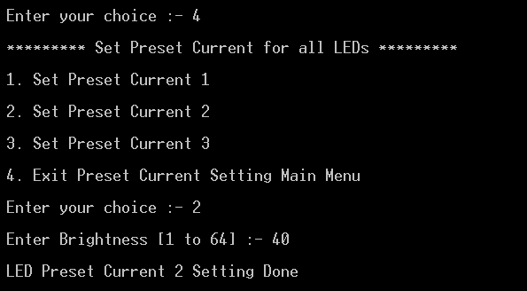

# NXP Application Code Hub

## PCA9959HN led driver with demo app running on FRDM-MCXN947 and FRDM-MCXA153
PCA9959 is a daisy-chain SPI-compatible 4-wire serial bus controlled 24-channel
constant preset current LED driver, optimized for dimming and blinking 63 mA Red/
Green/Blue/Amber (RGBA) LEDs.

This demo application provides a command line interface which allows the user to easily explore the different functions of the driver to use the LED controller features for grid duration control , grid-group configuration, channel configuration and gradation control

### PCA9959 Block Diagram

### Key Features of PCA9959 LED Driver

- 24 constant preset current output channels can sink up to 63 mA, tolerate up to 5.5 V when OFF
- Each LED output has its own 6-bit resolution (64 steps) preset current configuration, with an absolute accuracy of ±8 %.
- PCA9959 supports up to four groups of LED gradation control, with each LED channel assigned to one of the groups.
- For each group, PCA9959 supports 64-grid brightness control, with the time duration of each grid adjustable from 2.5 μs to 1 ms.
- Each LED output can be off, on or set at its individual preset current value within each grid.
- Once gradation control enabled, PCA9959 will automatically change each LED preset current with the setup from grid0 to grid63.
- Once finished, it can hold grid63 or repeat from grid0 as configured.
- Open/short load/overtemperature detection mode to detect individual LED errors
- Active LOW output enable (OE) input pin
- No glitch on LEDn outputs on power-up
- Low standby preset current
- 6 bits programmable LED brightness
- Programmable LED output delay to reduce EMI and surge currents when off

#### Boards: FRDM-MCXA153, FRDM-MCXN947
#### Categories: User Interface
#### Peripherals: SPI
#### Toolchains: MCUXpresso IDE

## Table of Contents
1. [Software](#step1)
2. [Hardware](#step2)
3. [Setup](#step3)
4. [Results](#step4)
5. [FAQs](#step5) 
6. [Support](#step6)
7. [Release Notes](#step7)

## 1. Software
- [IoT Sensing SDK (ISSDK) v1.8](https://nxp.com/iot-sensing-sdk) offered as middleware in MCUXpresso SDK for supported platforms
- [MCUXpresso IDE v11.9.0](https://www.nxp.com/design/design-center/software/development-software/mcuxpresso-software-and-tools-/mcuxpresso-integrated-development-environment-ide:MCUXpresso-IDE)

## 2. Hardware
- FRDM-MCXN947 and FRDM-MCXA153 MCU board
- [PCA9959HN LED Driver](https://www.nxp.com/part/PCA9959HN#/) 
- Personal Computer
- Mini/Micro USB Type C USB cable

## 3. Setup
### 3.1 Step 1: Download and Install required Software(s)
- Install MCUXpresso IDE 11.9.0
- Download and Install [MCUXpresso SDK v2.14.0 for FRDM-MCXN947](https://mcuxpresso.nxp.com/en/builder?hw=FRDM-MCXN947). Make sure to select ISSDK  middleware while building SDK.
- Download and Install [MCUXpresso SDK v2.14.2 for FRDM-MCXA153](https://mcuxpresso.nxp.com/en/builder?hw=FRDM-MCXA153). Make sure to select ISSDK  middleware while building SDK.
- Install Git v2.39.0 (for cloning and running west commands).
- Install Putty/Teraterm for UART.
 
### 3.2 Step 2: Clone the APP-CODE-HUB/dm-pca9959hn-led-driver-with-demo-app
- Clone this repository to get the example projects:
- Change directory to cloned project folder: 
    cd *dm-pca9959hn-led-driver-with-demo-app*
 
**Note:** If you are using Windows to clone the project, then please configure filename length limit using below command
**git config --system core.longpaths true**

### 3.3 Step 3: Build example projects
- Open MCUXpresso IDE and select a directory to create your workspace.
- Install MCXUpresso SDK 2.14.x for FRDM-MCX947, FRDM-MCXA153 (drag and drop SDK zip into "Installed SDK" view) into MCUXpresso IDE.
- Go to "Quickstart Panel" and click on "Import Project(s) from file system",
- Select "Project directory (unpacked)" and browse to the cloned project folder.
- Select example projects that you want to open and run.
- Right click on project and select build to start building the project.

## 4. Test Application Steps
- User need to check COM port after connecting USB cable between Host PC and Target Board via device manager.

- Open PUTTY/Teraterm application installed on your Windows PC with Baudrate 115200 and assigned COM port as mentioned in above step.

- After right click on project and select "Debug As", Demo application will run in interactive mode. When the demo runs successfully, you can see the logs printed on the terminal.

## 4.1 Logs Results

**Main Menu will look like this**

**Enter #1 to Start Side Control** 

- Side Control provides two options:
  - Side Configuration 
  - Side Execute

- By deafult side 0 gets configured and executed.
- User can configure side 0/1 and perform LED control configurations (individual,all,range) as required.
- Switching between sides (using side execute) is only possible when gradation control is enabled. If gradation control is not enabled, side 0 keeps on executing even when you try to switch between sides.

**Enter #2 to perform Individual LED Control** 

- Individual LED control menu looks like this: 

- Individual LED control provides two sub options:
  - Individual grid group configuration 
  - Individual LED channel configuration

- Individual grid-group configuration prompts the user to enter:
  - Group number which will get assigned to that particular grid.
  - Grid preset current configuration (Select any one):
    - 1: LED in group is in off state.
    - 2: Use Preset Current 1 setting in LEDs
    - 3: Use Preset Current 2 setting in LEDs
    - 4: Use Preset Current 1 setting in LEDs

  - Ending grid number, which denotes how many grids you want to enable starting from grid 0 till the (endingGrid - 1).

  

- Individual LED channel configuration menu looks like this:

  

- Individual LED channel configuration sub-menu:
  - LED channel enable: which asks the user to input LED number which user want to turn on.

    

  - LED channel group assignment: which asks the user to input LED number and group number in which user wants to assign that particular LED.

    

  - Set preset current for LED channel: which asks the user to input preset current setting which user wants to configure, LED number chosen and brightness value [1-64] for the LED enabled.
  
    

  - LED channel disable: Option to turn off any LED by giving LED number as input.

    

**Enter #3 to perform All LED Control** 

- All LED control menu looks like this:

  

- All LED control provides two sub options:
  - All grid group configuration 
  - All LED channels configuration

- All grid-group configuration prompts the user to enter:
  - Group number which will get assigned to that particular grid.
  - Grid preset current configuration (Select any one):
    - 1: LED in group is in off state.
    - 2: Use Preset Current 1 setting in LEDs
    - 3: Use Preset Current 2 setting in LEDs
    - 4: Use Preset Current 1 setting in LEDs
  - Ending grid number, which denotes how many grids you want to enable starting from grid 0 till the (endingGrid - 1).

   

- All LED channel configuration menu looks like this:

   

- All LED channel configuration sub-menu:
  - LED channel enable: To enable all the LEDs.

    

   - LED channel group assignment: which asks the user to input group number in which user wants to assign all the LEDs.

     

    - Set preset current for LED channel: which asks the user to input preset current setting which user wants to configure and brightness value [1-64] for the all the LEDs.
  
      

   - LED channel disable: Turns off all the LEDs.

      

**Enter #4 to control LEDs in range** 

- LEDs in [0-23] range can be controlled using this option. For example if user choses start and end values as 1 and 8 respectively, range will be [0-7].

Note: User can put some LEDs in one group, some in other group and with different preset current configurations and enable gradation to see the different effect on different LEDs as per the configurations.

- LEDs control in range menu looks like this:

  

- LEDs control in range provides two sub options:
  - Range grid group configuration 
  - Range LED channel configuration

- All grid-group configuration prompts the user to enter:
  - Group number which will get assigned to that particular grid.
  - Grid preset current configuration (Select any one):
    - 1: LED in group is in off state.
    - 2: Use Preset Current 1 setting in LEDs
    - 3: Use Preset Current 2 setting in LEDs
    - 4: Use Preset Current 1 setting in LEDs
  - Ending grid number, which denotes how many grids you want to enable starting from grid 0 till the (endingGrid - 1).

   
  
- Range LED channel configuration menu looks like this:

  

- All LED channel configuration sub-menu:
  - LED channel enable: To enable LEDs in [start-end] range.

    

   - LED channel group assignment: which asks the user to input group number in which user wants to assign all the LEDs, LED start value and LED end value.

     

    - Set preset current for LED channel: which asks the user to input LED start value, LED end value preset current setting which user wants to configure and brightness value [1-64] for the all the LEDs.
  
      

   - LED channel disable: Turns off LEDs in [start-end] range. 

     

**Enter #5 for gradation configuration** 

- Gradation configuration submenu have these options:
  - Grid duration: which have options to set TStep value and Duration count value
    where, GridDuration = TStep * (durcnt + 1).

  

  - Gradation Mode: Set Gradation mode to OneShot/Continuous.

   

  - Start Gradation: To Start Gradation.

  - Stop Gradation: To Stop Gradation.

**Enter #6 to set turn on delay between LEDs** 

- User can set turn on delay of 50ns between turning on of each LED output. i.e 50ns delay between each LED output.

**Enter #7 to perform System RESET On LEDs** 

- All registers settings on device will get reset after perfoming RESET. 

  Note: When a reset of PCA9959 is activated using an active LOW input on the RESET pin, a reset pulse width of 2.5 μs minimum is required.

  

**Enter #8 to use 20MHz clock for gradation control** 

- PCA9959 have 20MHz clock for gradation control which can be enabled by using ceralock resonator which is present between OCSCIN and OSCOUT pin of PCA9959 IC.
- By default, PCA9959 uses 8MHz internal clock for operations other than gradation control.
- User can provide external 20MHz clock on PCA9959 shield board usinng clock generator if user doesnt want to use already available 20MHz clock using ceralock resonator.

  

**Enter #9 to perform Sleep Control on LEDs** 

- Once sleep mode is enabled on device the currently glowing LEDs will go on sleep mode and once sleep is disabled all configured LEDs (Gradation ,LED On/Off) will get retrieved as set by user.

  

**Enter #10 for Auto switch off On Error control** 

- This feature will ensure that if any fault occurred on LED Chennels, it will automatically turn off that particular LED channel , so that it does not impact other channels.
  
  Note: If you are not using external supply, please disable auto sleep off on error control.

  

**Enter #11 to Set Max Current**

- Maximun current control is used to set:
  - 30mA current for LED driver 
  - 20mA current for LED driver

  

**Enter #12 to check Error Control**

- LED Error Feature is used to check these two conditions:
  - Open Cirucit Condition
  - Short Cirucit Condition
- Check any Error (if occurred)
  - Clear Errors (if any)
  - Check Individual LED errors by giving LED number as input.

  

**Enter #13 for Over Temperature Check**

- Over Temperature Check feature will check the current temperature , it measures the over and under temperature conditions and display the message accordingly.
- If working under control it shows, **Operating in under temperature**

**Enter #14 for checking presence of valid external clock**

- If no external clock is provided for gradation control using clock generator on OSCIN, and user check presence of valid external clock, it will give output as **clock detected is not in correct range** 
- If valid external clock is provided or the user uses ceralock resonator provided in IC for 20MHz clock for gradation control, it will give output as 
**Clock detected in correct range**

Note: User should use ceralock resonator only for generating 20MHz clock for gradation control.

## 5. Know Limitations

 - PCA9959HN-ARD sometimes detects faults (short circuit) on different LED channels when supply given by base board so It is recommended to use external supply (3V - 3.3V) on J1 (To use external supply Please connect pin number 2 and 3 of J2).
 - Use Stackable Female Header Connector to connect base and shield board, so it gets stacked properly. 

## 6. FAQs
*Include FAQs here if appropriate. If there are none, then state "No FAQs have been identified for this project".*

## 7. Support
*Provide URLs for help here.*

#### Project Metadata
<!----- Boards ----->
 

<!----- Categories ----->

<!----- Peripherals ----->

<!----- Toolchains ----->

Questions regarding the content/correctness of this example can be entered as Issues within this GitHub repository.

>**Warning**: For more general technical questions regarding NXP Microcontrollers and the difference in expected funcionality, enter your questions on the [NXP Community Forum](https://community.nxp.com/)

## 8. Release Notes
| Version | Description / Update                           | Date                        |
|:-------:|------------------------------------------------|----------------------------:|
| 1.0     | Initial release on Application Code Hub        | July 5th 2024 |

